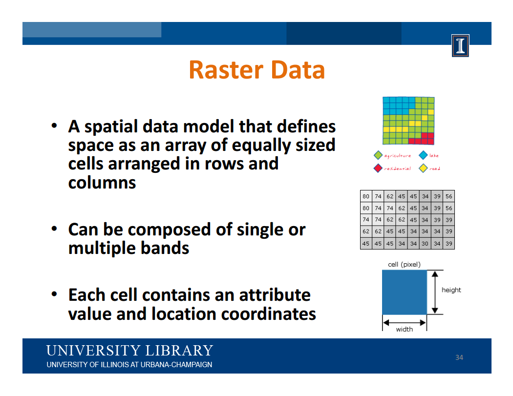
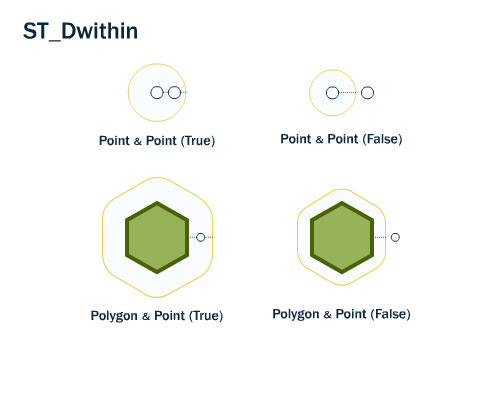
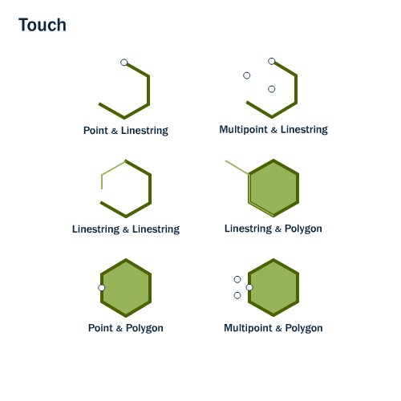
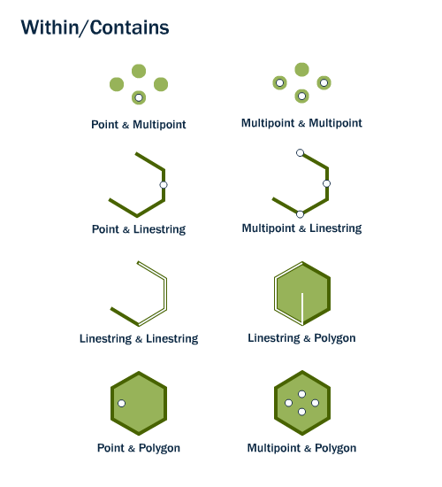

class: center, middle <!-- for title in the center of the slide -->
name: primera-diapo

Francisco Puga

fran.puga (at) gmail.com

https://twitter.com/fpuga

http://conocimientoabierto.es


???

python -m SimpleHTTPServer 8000


---

.center[]

---

.center[]

 > "Everything is related to everything else,  
 > but near things are more related than distant things",  
 > [First Law of Geography](https://en.wikipedia.org/wiki/Tobler%27s_first_law_of_geography)  


???

http://giphy.com/gifs/elephant-wastedgifs-12oFDpQAh4ZvSU


---

* Qué es PostGIS
* Información Geográfica. Layers. Vectorial vs Ráster. Proyecciones
* Qué es PostGIS
* Instalación y Configuración
* Geometrías e Índices espaciales
* Funciones básicas

---


# ¿Cómo almaceno y manipulo información geográfica en una base de datos?

.center[]


???

... Por empezar por lo básico, PostGIS es la respuesta a la pregunta

---

.center[]

.footnote[http://www.library.illinois.edu/sc/datagis/GIS101_Slides_SavvyResearcher_2016.pdf]

---

.center[]

.footnote[http://www.library.illinois.edu/sc/datagis/GIS101_Slides_SavvyResearcher_2016.pdf]

---

.center[]

.footnote[http://www.library.illinois.edu/sc/datagis/GIS101_Slides_SavvyResearcher_2016.pdf]

---

.center[]

.footnote[http://www.library.illinois.edu/sc/datagis/GIS101_Slides_SavvyResearcher_2016.pdf]

---


.center[]

.footnote[http://www.library.illinois.edu/sc/datagis/GIS101_Slides_SavvyResearcher_2016.pdf]

---

# [Todos los mapas están mal](https://youtu.be/pC4MwdqYeCI?t=2m4s)

---
.center[]

.footnote[http://www.library.illinois.edu/sc/datagis/GIS101_Slides_SavvyResearcher_2016.pdf]

---

.center[]

.footnote[http://www.library.illinois.edu/sc/datagis/GIS101_Slides_SavvyResearcher_2016.pdf]

---

.center[]

.footnote[http://www.library.illinois.edu/sc/datagis/GIS101_Slides_SavvyResearcher_2016.pdf]

---

.center[[](https://xkcd.com/977/)]

---

.center[]

.footnote[http://psanxiao.com/el-centro-del-mundo]

---

# Proyecciones

* EPSG:4326 (GPS, GeoJSON, habitual si no necesitas precisión)
* EPSG:3857 (~4326, Google Maps, OpenStreetMap)
* EPSG:25829, EPSG:25830 (Oficial de España Peninsular)

.footnote[http://epsg.io/]

???

Si no estáis en el mundo GIS, lo que tenéis que saber sobre proyecciones son tres cosas:

* Usad siempre 4326
* Si trabájais con cartografía española oficial 25830 para la península, 25829 para galicia, y la de canarías es otra
* Cada cual tiene la suya

---

# ¿Qué es PostGIS?

* [http://postgis.net](http://postgis.net)
* Una extensión para [PostgreSQL](https://www.postgresql.org)
* Gratuita, Software Libre y *State of the Art*
* Conforme a standards ([Simple Feature Access](http://www.opengeospatial.org/standards/sfs))
* Fácil de usar

# ¿Qué aporta PostGIS a PostgreSQL?

* Nuevos tipos de datos. Fundamentalmente: *GEOMETRY* (Raster, Geography, ...)
* Nuevas funciones: *ST_xxx*

---

# Aunque hace muchas más cosas

* [Cálculo de rutas](http://pgrouting.org/)
* [Geocodificación y Geodificación inversa](http://postgis.net/docs/manual-dev/Extras.html) (Sólo EEUU)
* [Conectar con excel](http://www.postgresonline.com/journal/archives/339-OGR-foreign-data-wrapper-on-Windows-first-taste.html) (PostGIS + OGR FDW)
* [Manipulación de imágenes](http://www.bostongis.com/blog/index.php?/archives/205-Waiting-for-PostGIS-2.1-ST_Resize-not-just-for-GIS.html) (resize, ...)
* Topología, Segmentación Dinámica y Referenciación Lineal, 3D, [LIDAR](https://github.com/pgpointcloud/pointcloud), ...

???

Aunque hace muchas más cosas. Tanto relacionadas con los datos espaciales, como más curiosas como poder manipular imágenes en la base de datos (reescalado,...)

---


# Instalación

```bash
sudo apt-get update
sudo apt-get install -y postgresql postgresql-contrib
sudo apt-get install -y postgis postgresql-9.5-postgis-2.2

sudo -u postgres createdb -E UTF8 postgis_example
sudo -u postgres psql -d postgis_example -c "CREATE EXTENSION postgis;"
```

En windows (o linux, o mac) podemos usar un [instalador](http://www.enterprisedb.com/products-services-training/pgdownload#windows)

---

# Don't do this (only for version < 2.0)

```bash
sudo -u postgres createdb template_postgis
sudo -u postgres createlang plpgsql template_postgis
sudo -u postgres psql -d template_postgis -c "UPDATE pg_database SET datistemplate=true WHERE datname='template_postgis'"
sudo -u postgres psql -d template_postgis -f /usr/share/postgresql/8.4/contrib/postgis-1.5/postgis.sql
sudo -u postgres psql -d template_postgis -f /usr/share/postgresql/8.4/contrib/postgis-1.5/spatial_ref_sys.sql
sudo -u postgres psql -d template_postgis -f /usr/share/postgresql/8.4/contrib/postgis-1.5/postgis_comments.sql

```

---

```sql
SELECT PostGIS_Full_Version();

\d spatial_ref_sys
\d geometry_columns
\d geography_columns
```
---

# Configuración

La misma que PostgreSQL

---

#### Crear una tabla de puntos

```sql
CREATE TABLE cities (
  gid SERIAL PRIMARY KEY,
  name text,
  geom GEOMETRY(Point, 4326)
);
CREATE INDEX ON cities USING GIST ("geom");
```

#### Crear una tabla de líneas

```sql
CREATE TABLE streets (
  gid SERIAL PRIMARY KEY,
  name text,
  geom GEOMETRY(MultiLineString, 4326)
);
CREATE INDEX ON streets USING GIST ("geom");
```

#### Crear una tabla de polígonos

```sql
CREATE TABLE cities (
  gid SERIAL PRIMARY KEY,
  name text,
  geom GEOMETRY(MultiPolygon, 4326)
);
CREATE INDEX ON cities USING GIST ("geom");
```

???

Representar información geográfica. Ciudad como punto o como polígono. Carretera como punto o como polígono. Ciudades en un mapa del mundo: puntos, Si quiero representar los colegios dentro de una ciudad: polígono

---

#### Dont' do this (casos especiales y versiones < 2.0)

```sql
SELECT AddGeometryColumn ('my_schema','my_spatial_table','geom',4326,'POINT',2);
SELECT Populate_Geometry_Columns();
SELECT DropGeometryTable ('my_schema','my_spatial_table');
```

---

# El tipo GEOMETRY

* Es un tipo más de la base de datos.
* Permite definirse en "cualquier" sistema de coordenadas.
* Número ilimitado de dimensiones.
* Distintos tipos de datos (Point, GeometryCollection, MultiPolygon)
* No es necesario especificar los modificadores de tipo, pero hacer establece CONSTRAINTS

.center[]

---

# Tipos de Geometrías

* Point: Latitud, Longitud
* LineString: Conjunto ordenado de puntos
* LinearRing: Curvas. Poco usado salvo para polígonos.
* Polygon: Conjunto de líneas cerrado, puede contener múltiples huecos
* MultiPoint: Nube de Puntos
* MultiLineString: Manojo de líneas
* MultiPolygon: Varios polígonos
* GeometryCollection: Una colección de distintos tipos de geometrías

---

#### Single vs Multi vs Geometry Collection

* Geometry Collection: GEOMETRY que almacena geometrías de distinto tipo a la vez
* Single. Cada fila de la base de datos es una sóla geometría (POINT, LINESTRING, POLYGON)
* Multi. Cada fila de la base de datos puede almacenar más de una geometría del mismo tipo (MULTIPOINT, MULTILINESTRING, MULTIPOLYGON)

???

https://alastaira.wordpress.com/2011/01/21/splitting-multi-geometries-into-single-geometries/

Consejo: No usar geometry collection y usar siempre Multi

---

#### Coordenadas Z y/o M

* Point: POINT(0 0) -- XY
* PointZ: POINT(0 0 10) -- XYZ
* PointM: POINT(0 0 10) -- XYM
* PointZM POINT(0 0 10 10) -- XYZM
* MultiPolygonZM, LineStringM, ....

---

# PostGIS spatial indices

* [R-tree](https://en.wikipedia.org/wiki/R-tree). [Paper original](http://postgis.org/support/rtree.pd). [GiST](https://en.wikipedia.org/wiki/GiST)
* Mismo mantenimiento que resto de índices
* Explode/Dump Multigeometries for better perf

.center[]

---
    
# Consultas y operaciones (1)


---

# Consultas y operaciones (2)

.center[]

.center[]

---

# Consultas y operaciones (3)

.center[]

---

# Consultas y operaciones (4)

```sql
SELECT row_to_json(fc)
FROM ( 
   SELECT 'FeatureCollection' As type,
          array_to_json(array_agg(f)) As features
   FROM (
     SELECT 'Feature' As type,
            ST_AsGeoJSON(lg.geom)::json As geometry,
            row_to_json(
              ( SELECT l FROM (SELECT gid, name) As l )
            ) As properties
     FROM cities As lg
   ) As f
)  As fc;
```
???

http://www.postgresonline.com/journal/archives/267-Creating-GeoJSON-Feature-Collections-with-JSON-and-PostGIS-functions.html

---

class: smallsize

```json
{
  "type": "FeatureCollection",
  "features": [
    {
      "type": "Feature",
      "geometry": {
        "type": "Point",
        "coordinates": [ 42.223, -8.731 ]
      },
      "properties": {
        "gid": 1,
        "name": "Vigo"
      }
    },
    {
      "type": "Feature",
      "geometry": {
        "type": "Point",
        "coordinates": [ 43.371, -8.395 ]
      },
      "properties": {
        "gid": 2,
        "name": "A Coru\u00f1a"
      }
    },
    {
      "type": "Feature",
      "geometry": {
        "type": "Point",
        "coordinates": [ 42.883, -8.533 ]
      },
      "properties": {
        "gid": 3,
        "name": "Santiago de Compostela"
      }
    }
  ]
}
```
---
# Funciones básicas

* ST_MakePoint(Longitude, Latitude)
* ST_GeomFromText(WellKnownText, srid)
* ST_SetSRID(geometry, srid)
* ST_AsText(geometry)
* ST_AsGeoJSON(geometry)
* ST_AsGML(geometry)
* ST_X(point)
* ST_Y(point)
* ST_StartPoint(geometry)
* ST_EndPoint(geometry)
* ST_Area(geometry)
* ST_Length(geometry)
* ST_Perimeter(geometry)
* ST_NumPoints(linestring)
* ST_NumGeometries(geometry)

---

# Más funciones (Operaciones espaciales)

* ST_Buffer
* ST_Transform(geometry, integer)
* ST_Union
* ST_Intersection(geometry, geometry)

.footnote[[https://geotalleres.github.io/geotalleres/postgis-analisis-espacial/analisis_espacial.html](https://geotalleres.github.io/geotalleres/postgis-analisis-espacial/analisis_espacial.html)]

---

# Más funciones (Validación de geometrías)

* ST_IsValid(geometry)
* ST_IsValidReason(geometry)
* ST_MakeValid(geometry)

.footnote[[https://geotalleres.github.io/geotalleres/postgis-validacion/validacion.html](https://geotalleres.github.io/geotalleres/postgis-validacion/validacion.html)]

---
# Más funciones (relaciones espaciales)

* ST_Distance(geometry, geometry)
* ST_Within(geometry, geometry)
* ST_DWithin(geometry, geometry, radius)
* ST_Intersects(geometry, geometry) st_intersects.png
* ST_Contains(geometry, geometry)
* ST_Covers(geometry, geometry)
* ST_Crosses(geometry, geometry)
* ST_Disjoint(geometry, geometry)
* ST_Overlaps(geometry, geometry)
* ST_Touches(geometry, geometry)

.footnote[[https://geotalleres.github.io/geotalleres/postgis-relaciones-espaciales/relaciones_espaciales.html](https://geotalleres.github.io/geotalleres/postgis-relaciones-espaciales/relaciones_espaciales.html)]

---

.center[]

---

.center[]

---

.center[]

---

.center[]

---

.center[]

---

.center[]

---

.center[]

---


# DE-9IM

* https://en.wikipedia.org/wiki/DE-9IM
* ST_Relate
* [Covers vs Contains](https://lin-ear-th-inking.blogspot.com.es/2007/06/subtleties-of-ogc-covers-spatial.html)

.center[]

---

# ¿GeomA = GeomB?

Hay muchas formas de ver si dos [geometrías son iguales](http://revenant.ca/www/postgis/workshop/equality.html). Interesa una forma más estricta o no según el caso.

.center[]


* ST_OrderingEquals: Exactamente iguales (incluido orden vértices)
* ST_Equals: Ocupan el mismo espacio físico
* [~=](http://postgis.net/docs/manual-2.0/ST_Geometry_Same.html) Ocupan el mismo bounding box
* &&: Bounding Box que se tocan

---

# Funciones 3D


---

# PostGIS Ráster

* https://geotalleres.github.io/geotalleres/postgis-raster/postgis_raster.html

---

# Cargar datos espaciales (1)

```sql
INSERT INTO cities (name, geom) VALUES 
(
  'Vigo',
  ST_GeomFromGeoJSON(
    '{"type":"Point","coordinates":[42.223, -8.731]}'
  )
),
(
  'A Coruña',
  ST_GeomFromText(
    'POINT(43.371 -8.395)',
    4326
  )
),
(
  'Santiago de Compostela',
  ST_SetSRID(
    ST_MakePoint(42.883, -8.533),
    4326
  )
);
```
---

# Cargar datos espaciales (2)

### De shape

```bash
shp2pgsql -s 4326 -W UTF-8 cities.shp cities > cities.sql
psql -d postgis_example -f cities.sql
```

### De otras fuentes

* [ogr2ogr](http://slides.com/michalzimmermann/postgis-workshop#/0/5)
* gis de escritorio
* osm. osm2pgsql -U postgres -d dump.osm
* scripting
* [http://slides.com/michogar/postgis-hacksb#/46](http://slides.com/michogar/postgis-hacksb#/46)
* [Ejercicios](https://geotalleres.github.io/geotalleres/postgis-importacion-exportacion/importacion_exportacion.html)

---

# PostGIS OGR FDW

* [http://slides.com/michalzimmermann/postgis-workshop#/0/6](http://slides.com/michalzimmermann/postgis-workshop#/0/6)

---


# Python y PostGIS

* [GeoDjango](https://docs.djangoproject.com/en/1.10/ref/contrib/gis/)
* [GeoAlchemy](http://geoalchemy.org/)
* [pyscopg-postgis](https://github.com/yohanboniface/psycopg-postgis)
* [bindings gdal/ogr](https://pypi.python.org/pypi/GDAL/)
* [shapely](https://github.com/Toblerity/Shapely), [fiona](https://github.com/Toblerity/Fiona), [rasterio](https://github.com/mapbox/rasterio)

---

# Shapely, Fiona y Rasterio

* Wrappers pythonicos sobre GDAL/OGR
* Fáciles de usar
* Fiona: Leer y escribir
* Shapely. Manipulación (Operaciones geométricas)
* Rasterio. Ráster

```python
from shapely.geometry import mapping, shape
from fiona import collection

with collection("some.shp", "r") as input:
    # schema = input.schema.copy()
    schema = { 'geometry': 'Polygon', 'properties': { 'name': 'str' } }
    with collection(
        "some_buffer.shp", "w", "ESRI Shapefile", schema) as output:
        for point in input:
            output.write({
                'properties': {
                    'name': point['properties']['name']
                },
                'geometry': mapping(shape(point['geometry']).buffer(5.0))
            })
```

---
### geoalchemy - Instalación

```bash
pip install psycopg2 SQLAlchemy geoalchemy2
```

---

### geoalchemy - Modelos (1)

```python
from sqlalchemy.ext.declarative import declarative_base
from sqlalchemy import Column, Integer, String
from geoalchemy2 import Geometry

Base = declarative_base()

class Cities(Base):
    __tablename__ = 'cities'
    gid = Column(Integer, primary_key=True)
    name = Column(String)
    geom = Column(Geometry('POINT', '4326'), index=True)
    
    def __json__(self, request):
        from geoalchemy2.shape import to_shape
        from shapely.geometry import mapping

        return {
            'gid': self.gid,
            'name': self.name,
            'geom': mapping(to_shape(self.geom))
        }
```

---

### geoalchemy - Modelos (2)
```python
    def as_geojson_feature(self, request):
        from geoalchemy2.shape import to_shape
        from shapely.geometry import mapping

        return {
            'type': 'Feature',
            'properties': {
                'gid': self.gid,
                'name': self.name,
            },
            'geometry': mapping(to_shape(self.geom))
        }
```

---

### geoalchemy - Modelos (3)

```python
    def update_from_json(self, json):
        from geoalchemy2.shape import from_shape
        from shapely.geometry import shape
        
        self.gid = json.get('gid')
        self.name = json.get('name')
        self.geom = from_shape(shape(json.get('geometry')))
```
---


# GeoDjango

* [Tutorial](https://docs.djangoproject.com/en/1.11/ref/contrib/gis/tutorial/)
* Proporciona nuevos Fields, funciones para el ORM, utilidades de Admin, ...
* Necesita la [instalación](https://docs.djangoproject.com/en/1.11/ref/contrib/gis/install/) de librerías base adicionales

```bash
sudo apt-get install binutils gdal libproj-dev gdal-bin psycopg2 python-gdal

```

---

# Configuración

* settings.py (DATABASE, e INSTALLED_APPS)

```python
DATABASES = {
    'default': {
         'ENGINE': 'django.contrib.gis.db.backends.postgis',
         'NAME': 'geodjango',
         'USER': 'geo',
    },
}

INSTALLED_APPS += [ 'django.contrib.gis' ]
```

---

# Modelos

* Autogeneración de modelos: [ogrinspect](https://docs.djangoproject.com/en/1.11/ref/contrib/gis/tutorial/#try-ogrinspect)

```python
from django.contrib.gis.db import models

class Cities(models.Model):
    name = models.CharField(max_length=50)
    geom = models.PointField()

    def __str__(self):
        return self.name
```

---

# Queries

```python
vigo = Cities.objects.get(name='Vigo')
vigo.geom.wkt
vigo.geom.geojson

WorldBorder.objects.filter(mpoly__contains=vigo.geom)

<QuerySet [<WorldBorder: Spain>]>

```

---

# API Rest - GeoJSON

* [Django Rest Framework GIS](https://github.com/djangonauts/django-rest-framework-gis)

```bash
pip install djangorestframework-gis
```

```python
INSTALLED_APPS += ['rest_framework', 'rest_framework_gis']
```

* serializers.py

```python
from rest_framework_gis.serializers import GeoFeatureModelSerializer

class CitySerializer(GeoFeatureModelSerializer):
    class Meta:
        model = Cities
        geo_field = "geom"
        fields = ('id', 'name')
```
        
        
---
# PostGIS 

Francisco Puga

fran.puga (at) gmail.com

https://twitter.com/fpuga

http://conocimientoabierto.es

http://icarto.es

