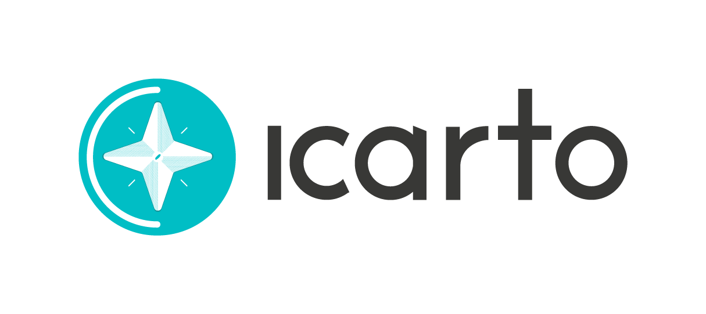
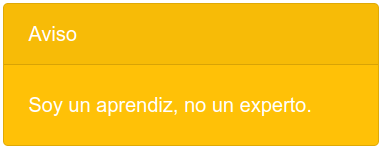
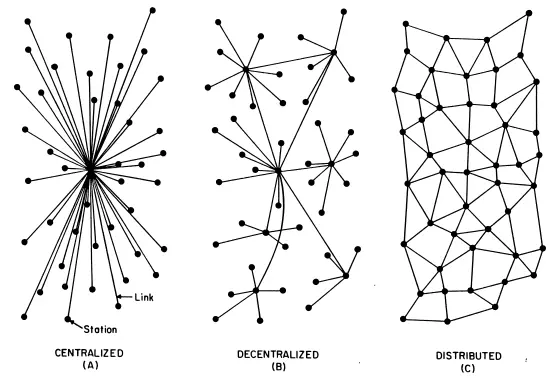
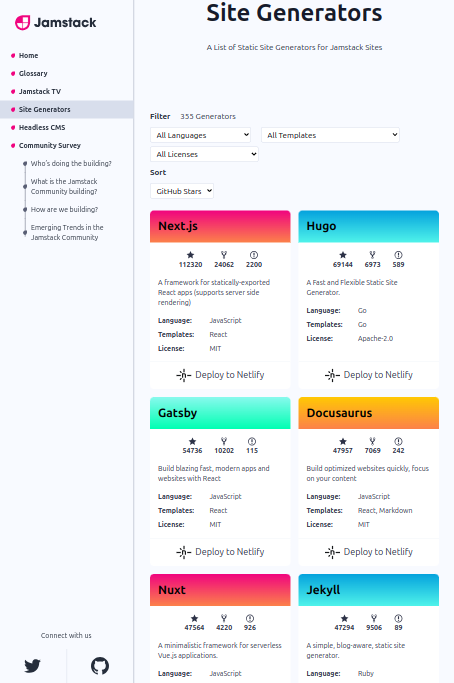
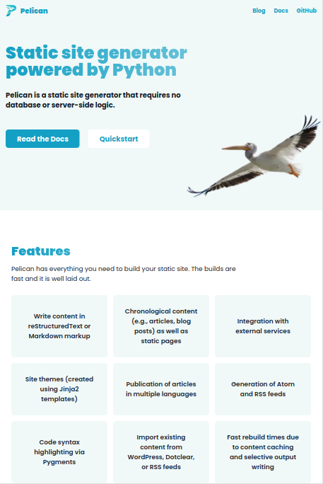
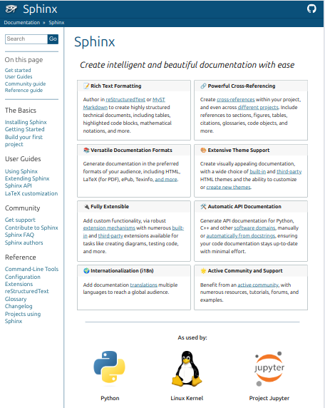
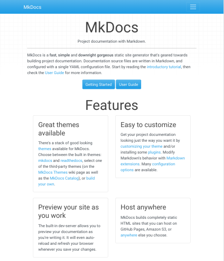
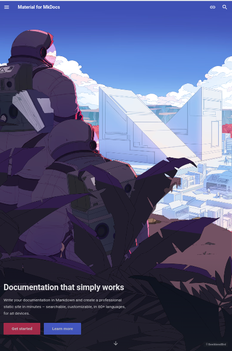

# De WordPress a MkDocs

## Cómo y Porqué

---

## License

The documentation of this project is licensed under the [CC-BY-SA-4.0](https://choosealicense.com/licenses/cc-by-sa-4.0/).

The underlying source code is licensed under the [GNU AGPLv3](https://choosealicense.com/licenses/agpl-3.0/).

Media could have their own trademarks and licenses.

---

fpuga

fpuga@icarto.es



---

-   ¿Quién tiene un blog?
-   ¿Con WordPress?
-   ¿Con Python? ¿Con qué tecnología?

---



???

-   No soy experto en escribir, blogs, WordPress ni MkDocs
-   Aprovecho estos talleres para aprender y cerrar cosas que empiezo y nunca termino
-   Aporto la perspectiva de quien quiere empezar a pelearse con algo.
-   Pero no sólo desde el punto de vista tecnológico. Si quieres un tutorial RTFM. Cualquier software bueno tiene una documentación buena
-   Me gusta explicar el porqué de las decisiones, y los trucos y WTF que no saltan a primera vista
-   Esto va de mis casos de uso. No digo que esta forma de trabajar es la mejor, si no que a mi me va bien

---

## ¿Por qué esta charla?

???

-   Cuando internet molaba
-   De Software, Comunicación y KISS

El objetivo de esta charla es animar a la gente a escribir y que la tecnología no sea un impedimento, sino una ayuda.

--

## Cuando internet molaba

<div class="container">

<div class="col">

<figure>
  
  <figcaption>Baran, Paul, <a href="https://www.rand.org/pubs/research_memoranda/RM3420.html">On Distributed Communications: I. Introduction to Distributed Communications Networks</a>. Santa Monica, CA: RAND Corporation, 1964.</figcaption>
</figure>

</div>

<div class="col">
 
<figure class="quote" style="font-size: medium;">
  <blockquote style="width: 80%;">
    Governments of the Industrial World, you weary giants of flesh and steel, I come from Cyberspace, the new home of Mind. On behalf of the future, I ask you of the past to leave us alone. You are not welcome among us. You have no sovereignty where we gather.
  </blockquote>
  <figcaption>
    &mdash; John Perry Barlow, <cite><a href="https://en.wikipedia.org/wiki/A_Declaration_of_the_Independence_of_Cyberspace">A Declaration of the Independence of Cyberspace</a></cite>. 1996.
  </figcaption>
</figure>

</div>

</div>

???

**Internet**, la red de redes, tenía una arquitectura distribuida y era un espacio para la **Ciudadanía**. En realidad era tech complicada, y sólo había espacio para _hackers_.

Luego llegó la [Web 2.0](https://en.wikipedia.org/wiki/Web_2.0) (con WordPress a la cabeza), y cualquier muggle podía ser un [prosumidor](https://en.wikipedia.org/wiki/Prosumer) ¿alguien recuerda el término?.

Y luego llegó la [burbuja de las puntocom](https://es.wikipedia.org/wiki/Burbuja_puntocom), y Google, Amazon, Facebook, Twitter, TikTok, ... y nos dimos cuenta de que [nosotras somos el producto](https://www.fabricantededinero.com/si-no-pagas-por-el-producto-tu-eres-el-producto-a-que-se-refiere/).

Y todo pasó muy rápido, e internet será distribuida pero la Web es centralizada y las Plataformas (red social es un mal término) la controlan.

Tener nuestro propio servidor de correo ya es imposible, pero los Blogs y el RSS no nos los pueden quitar.

Tener un blog es casi un acto subversivo ;P

--

## De Software, Comunicación, Conocimiento y KISS

???

Pero tener un blog, o escribir, no significa que tengamos que publicar. Puede ser nuestro diario secreto, nuestra base de datos de conocimiento, o lo que queramos que sea.

La mayoría aquí trabajamos con intangibles, con conocimiento. La comunicación está en todo. Sea código, emails, informes, tickets o slacks. Y escribir es la base de ello

Pero muchas veces parece que se hace a las prisas, sin disfrutar de la escritura en sí, sin aprender a escribir. Aprendemos SOLID, pero nuestras frases tienen tres líneas con 5 adjetivos, 4 adverbios y 8 comas.

Y para mi KISS, no es sólo mantenerlo simple. Es párate, y piensa en el cliente/receptor del mensaje/usuaria. Pónselo fácil y útil.

Si algo es para mi importante en esta charla es esto. Escribid. Escribid bien. Escribir para los demás (que puedes ser tu dentro de un mes). Y no dejéis que lo qué hacéis sea capitalizado por los grandes centralizadores.

---

## WordPress

???

Y cerrando este paréntesis, ida-de-olla, llegamos a WordPress.

Un sw brutal, que democratizo el acceso a publicar en internet, y del que sólo tengo buenas palabras. Pero que no encaja en la forma en que yo escribo, y en esa filosofía KISS. Yo escribo más que nunca y publico menos que nunca.

Entrar a una web, con una base de datos, mil interfaces, los bloques de Gutemberg, ... Todo eso está muy bien para cierto público. Pero no encaja con mi filosofía KISS.

---

## Markdown

???

¿Qué es lo que encaja?.

Markdown en ficheros locales. Con mis herramientas.

-   https://daringfireball.net/projects/markdown/
-   https://github.blog/2017-03-14-a-formal-spec-for-github-markdown/

Markdown es un formato suficientemente bueno para la mayoría de usos. Permite _bases de datos de conocimiento_, tiene buenos editores (vscode), buenas herramientas (linter, formatter, syntax, deploy, ...), permite hacer presentaciones, se puede exportar a muchos formatos.

--

## Markdown vs RST

???

RST puede que sea superior pero Markdown es suficientemente bueno. Así que no compensa complicarse.

-   http://www.zverovich.net/2016/06/16/rst-vs-markdown.html
-   https://www.ericholscher.com/blog/2016/mar/15/dont-use-markdown-for-technical-docs/
-   https://www.dabapps.com/insights/why-i-use-markdown-for-documentation/
-   https://www.ericholscher.com/blog/2016/oct/6/authoring-documentation-with-semantic-meaning/
-   https://www.ericholscher.com/blog/2016/jul/1/sphinx-and-rtd-for-writers/

--

## Editor

-   vscode + extensiones

???

-   https://code.visualstudio.com/docs/languages/markdown

## Editores Desktop

-   https://github.com/wereturtle/ghostwriter
-   https://github.com/marktext/marktext
-   https://github.com/jamiemcg/remarkable
-   https://github.com/retext-project/retext

## Editores Web

-   https://github.com/joemccann/dillinger
-   NextCloud
-   https://github.com/benweet/stackedit

--

## Tooling

-   formatter: [Prettier](https://github.com/prettier/prettier)
-   linter: [markdownlint-cli2](https://github.com/DavidAnson/markdownlint-cli2)
-   deploy (Github Actions)
-   pre-commit
-   otras

--

## Base de datos de conocimiento

-   Ficheros con buenos nombres + vscode + MkDocs (si queremos renderizar)

???

Otra cosa útil de Markdown, con nuestras herramientas, en local es lo fácil que es hacer _knowledge databases_.

-   https://obsidian.md
-   https://github.com/logseq/logseq
-   https://jupyterbook.org
-   https://github.com/dvorka/mindforger

--

## Presentaciones

-   [reveal](https://revealjs.com/)

???

Ver las fuentes de esta charla como ejemplo de configuración de reveal, usando Markdown y con presentación aceptable en GitHub.

Hay herramientas chulas,

-   [mdp](https://github.com/visit1985/mdp) es una CLI que convierte directamente un .md a una presentación. Útil para urgencias y para compartir notas en una reunión de forma más agradable. [Tutorial](http://xmodulo.com/presentation-command-line-linux.html)

--

## Conversores

-   [Pandoc](https://pandoc.org/)

???

-   [.md -> LibreOffice](https://askubuntu.com/a/1190570)

---

Ok. Usamos Markdown. ¿Cómo convertimos un montón de ficheros a una web?

<figure>
  
  <figcaption>https://jamstack.org/generators</figcaption>
</figure>

???

Una herramienta de _generación de sitios estáticos_ que convierte el markdown a un blog. Con su html, estilo, rss, ...

Herramientas de estas hay mil millones. Algunas seguro que brutales. Las más conocidas Hugo, Jekyll o algo con JavaScript. Hay quien hace su propia herramienta, incluso partiendo de Django.

Pero, lo que yo quiero es escribir. No aprender una tecnología nueva. Hay gente que se toma su blog como un espacio para experimentar. Está genial. No es mi caso.

Que hacer entonces. Ver que soluciones hay en Python, porqué es el entorno que conozco y que reducirá cualquier problema tecnológico y la inversión de tiempo.

Lo que nos deja tres opciones:

-   Pelican
-   Sphinx
-   MkDocs

--

## Pelican

<figure>
  
  <figcaption>https://getpelican.com</figcaption>
</figure>

???

La elección lógica para hacer un blog o web. Todo va a funcionar. El equivalente a Jekyll o Hugo del mundo Python.

La cuestión es que no lo he usado nunca, y la inversión de tiempo que haga en Pelican va a ser difícil que la use para algo más. Hay alguna otra tecnología que sea suficientemente buena.

--

## Sphinx

<figure>
  
  <figcaption>https://www.sphinx-doc.org</figcaption>
</figure>

???

Sphinx, software brutal, muy conocido, ... Tiene soporte de primer nivel para Markdown, no sólo RST.

Está pensado sobre todo para documentación. Tiene un [plugin para blogs](https://ablog.readthedocs.io), pero no es muy fino.

-   https://www.errbufferoverfl.me/posts/2020/sphinx-blog-part-one/
-   https://chrisholdgraf.com/blog/2020/sphinx-blogging/
-   https://pydata-sphinx-theme.readthedocs.io/en/stable/
-   https://blog.readthedocs.com/sphinx-markdown-2021/
-   https://myst-nb.readthedocs.io/en/latest/
-   https://sphinx-design.readthedocs.io/
-   https://github.com/attakei/sphinx-revealjs

--

## MkDocs

<figure>
  
  <figcaption>https://www.mkdocs.org</figcaption>
</figure>

???

Menos conocido que Sphinx. Más sencillo. Muchos plugins y temas. Muy usado en proyectos de Software Libre y también en la documentación de productos privativos.

Está pensado para documentación. Hacer un blog con directamente con MkDocs es poco óptimo.

Pero, el plugin _Material for MkDocs_ tiene todo lo que necesitamos y más.

---

## Material for MkDocs

<figure>
  
  <figcaption>https://squidfunk.github.io/mkdocs-material</figcaption>
</figure>

???

No entramos en detalles porqué vamos a ver sus posibilidades en la práctica.

Vemos un poco las funcionalidades en la propia web y comentamos el modelo de negocio.

-   https://squidfunk.github.io/mkdocs-material/insiders/benefits/
-   https://squidfunk.github.io/mkdocs-material/#more-than-just-a-static-site
-   https://squidfunk.github.io/mkdocs-material/setup/
-   https://squidfunk.github.io/mkdocs-material/plugins/

Un par de cosas chulas por si no da tiempo

El aspecto y funcionalidad es muy configurable y sencillo de cambiar.

-   Custom hooks escritos en Python ante eventos como `pre-build`, `post-build`, ...
-   Plantillas en Jinja2. Cada tema aporta su estructura, llega con mantener la estructura de carpetas sobrescribiendo las que interesen.
-   Muy configurable
-   Varios idiomas
-   ...

--

-   ¿Cómo queremos desplegar?
-   ¿Cómo organizamos el blog?

???

## ¿Cómo queremos desplegar?

Tras ojear la documentación pensamos en cómo queremos desplegar.

-   Podemos tener un repositorio privado en el que hacemos el `build` y subimos los `assets` a un repo público o un hosting.
-   Podemos tener un repo público con las _páginas estáticas_ activadas donde subimos `assets` y `build`

## ¿Cómo organizamos el blog?

-   ¿Es sólo un blog con un _About_ o un par de páginas?
-   Voy a tener páginas de categorías, etiquetas, histórico por años, ...
-   Voy a tener páginas especiales: _Proyectos_, _Libros que leo_, ...
-   Cómo voy a organizar los artículos
    -   Todos en el mismo directorio
    -   Un directorio por artículo
    -   Categorizados por año

## Opinión

-   Repo privado con los borradores
-   Repo público con el texto y configuración
-   Despliegue en GitHub Pages con las Actions
-   Navegación mezclada

--

## Cómo se implementa en MkDocs

MkDocs propone una forma de trabajo que si nos encaja hace todo rápido y sencillo. Si no a través de configuración, plugins o tocando a mano, permite cualquier flujo.

---

## Proyecto inicial a mano

```console
USERNAME=fpuga
BLOG_NAME=pruebablog
mkdir "${BLOG_NAME}" && cd "${BLOG_NAME}" && git init
touch README.md && git add README.md && git commit -m "Initial commit" && git branch -M main
# Crear repo
# git remote add origin git@github.com:"${USERNAME}"/"${BLOG_NAME}".git
# git push -u origin main
# https://github.com/"${USERNAME}"/"${BLOG_NAME}"/settings/pages
# Deploy from a branch && gh-pages
python3 -m venv .venv && source .venv/bin/activate
python3 -m pip install mkdocs-material==9.5.38 mkdocs-rss-plugin==1.15.0
echo '
/.venv/
/site/
/.cache/
' >> .gitignore
mkdocs new .
# https://squidfunk.github.io/mkdocs-material/creating-your-site/#minimal-configuration
# site_url = https://"${USERNAME}".github.io/"${BLOG_NAME}"
# https://squidfunk.github.io/mkdocs-material/publishing-your-site/#with-github-actions
mkdocs serve # xdg-open http://127.0.0.1:8000
mkdocs build # Check in `site` folder
# Change something
git commit -am "Test" && git push origin
xdg-open https://"${USERNAME}".github.io/"${BLOG_NAME}"
```

???

Mostrar cómo queda

--

-   Pregunta: _¿Se puede hacer X cosa?_
-   Respuesta: _Sí_

???

Si hay alguna pregunta, de si se puede hacer x cosa, la respuesta es probablemente sí.

Vemos un ejemplo más complicado.

---

## Montar el blog

### Plantilla

-   [create-blog](https://github.com/mkdocs-material/create-blog)

### Copiando

-   [Conocimiento Abierto](https://github.com/fpuga/conocimientoabierto)

???

Ver mi repo para un ejemplo completo

Todo funciona bien sin necesidad de configurar. Todo se puede configurar.

-   Mostrar tree de docs. Artículos en la raíz, artículos en carpetas para agrupar imágenes, ...
-   Categorías (sólo blog) vs Etiquetas (Toda la página)
    -   Listado de categorías
-   Listados
-   Slugs u URLs

--

## Overrides

???

Cuando las cosas no se pueden configurar, tenemos la opción de sobrescribir cualquier aspecto del tema.

-   Clonamos en local el repositorio de mkdocs-material
-   En `src/templates` está lo que podemos sobrescribir.
-   Con las `dev tools` o a ojo identificamos el fichero a copiar
-   Lo copiamos a local a un directorio `overrides` manteniendo la estructura
-   Modificamos a gusto
-   No sólo templates. Cualquier cosa.
-   Cuidado porqué se queda desactualizado con la librería.

--

## Extra css, js, palette

---

## Exportar artículos desde WordPress

-   [wordpress-to-jekyll-exporter](https://github.com/benbalter/wordpress-to-jekyll-exporter)
-   [wordpress-export-to-markdown](https://github.com/lonekorean/wordpress-export-to-markdown)

???

Hay que exportar los artículos y las imágenes. Además de los metadatos de interés: url, categorías, etiquetas, ...

`wordpress-to-jekyll-exporter`. Plugin instalable en WordPress. En las imágenes pone las rutas absolutas. Está bastante bien. Un poco de scripting puede afinar el resultado. Por defecto, añade más metadatos a cada post que el otro.

`wordpress-export-to-markdown`. Desde WordPress se exporta todo el blog como XML (una opción que viene por defecto). Una CLI lo parsea generando los .md y descargando las imágenes. Cuando descargamos el repo a local y ejecutamos a mano, podemos modificar un archivo de settings interno que nos permite añadir más metadata y otras cosas. En mi caso, no descarga correctamente todas las imágenes (creo que es por un plugin de WordPress). Da más opciones de cómo configurar la salida.

Ver los ejemplos de salida.

Ninguno de los dos es perfecto. Toca un poco de scripting. Partiremos de `wordpress-to-jekyll-exporter`

--

## Gestión de las imágenes

Si se tiene una configuración complicada puede ser lo que más problemas dé. Revisar los artículos descargados para ver como los enlaza y tratar de replicar la estructura de carpetas en local. Una vez más o menos funcione ya se irá arreglando.

--

## Refactorizando los artículos

???

Ver posts en el repo

--

## RSS

-   [mkdocs-rss-plugin](https://github.com/guts/mkdocs-rss-plugin)

???

Debemos configurar el plugin de RSS para que genere los mismos, al menos temporalmente que los que teníamos en WordPress.

Pero hay varios bugs:

-   https://github.com/squidfunk/mkdocs-material/issues/7574
-   El formato WordPress no es admitido (no va el trailing slash). https://wordpress.com/support/feeds/

--

## Comentarios

???

https://squidfunk.github.io/mkdocs-material/setup/adding-a-comment-system/

--

## Otros

-   Programar horas de publicación
-   Publicar tweets anunciando nuevos artículos
-   ...

???

Con los hooks, y las github actions podemos hacer prácticamente cualquier cosa con poco esfuerzo y programando en Python.
