# Para desplegar tengo que coger el coche

---

## Licencias

-   Presentación: Esta obra está bajo una [CC-BY-SA-4.0](https://choosealicense.com/licenses/cc-by-sa-4.0/).
-   Imágenes: Salvo que se indique lo contrario, las imágenes contenidas en esta presentación son propiedad de iCarto y están protegidas por derechos de autor. Además, están sujetas a los derechos de imagen de las personas que aparecen en ellas. No pueden ser reproducidas o reutilizadas sin permiso explícito.
-   Otros elementos pueden tener sus propias marcas y licencias.

---

<figure>
  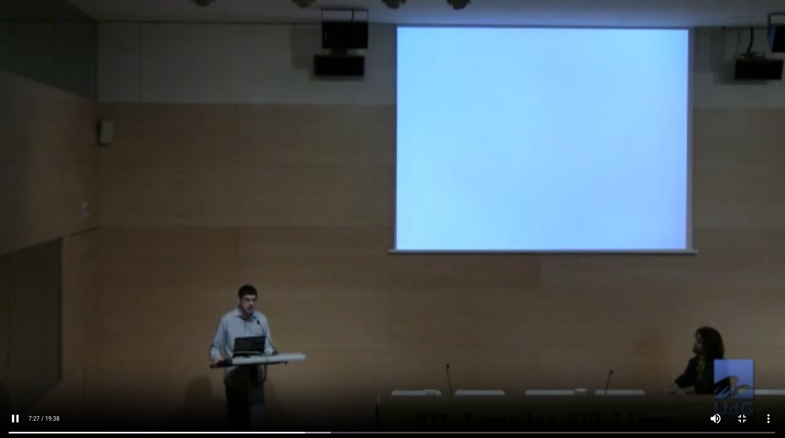
  <figcaption><a href="https://diobma.udg.edu/handle/10256.1/2961">Curso online de SIG Libre en Cooperación al Desarrollo desde una visión multidisciplinar</a>. 2013.</figcaption>
</figure>

???

En una conferencia hace quince años unos minutos antes de empezar la presentación añadí una diapositiva en blanco. Se habían pasado todo el día anterior hablando de la _nube_. Mi frase fue _esto es lo que significa la nube para miles de millones de personas en el mundo_

Ahora que soy menos inocente ...

---

???

ya no me hace falta esperar al último minuto. Puedo ponerla ya de primeras, y poner dos blanca seguidas.

Esto es lo que significa la nube.

---

???

Esto es lo que significa la IA

---

Francisco Puga

<a href="https://github.com/fpuga"></a>
<a href="https://stackoverflow.com/users/930271/francisco-puga"></a>
<a href="https://www.linkedin.com/in/francisco-puga-b25a8361/"></a>
<a href="https://x.com/fpuga"></a>
<a href="https://conocimientoabierto.es"></a>
<a href="mailto:fpuga@icarto.es"></a>

---

<a href="https://github.com/icarto"></a>
<a href="https://www.linkedin.com/company/icarto/"></a>
<a href="https://x.com/icarto"></a>
<a href="https://icarto.es"></a>
<a href="mailto:info@icarto.es"></a>

---

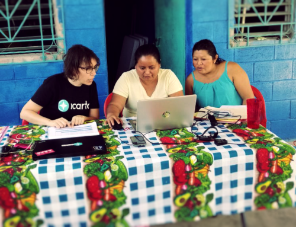

???

Esta es Iris, la verdadera protagonista de esta charla, secretaría de una Junta de Agua Rural de El Salvador.

Primera usuaria, de una aplicación que permite gestionar la parte administrativa Juntas de Agua Rurales de menos de 2.000 personas, de la que hablaremos un poco.

A su lado está Mireia, una compañera.

---

<figure>
  
  <figcaption>Este es el famoso coche.</figcaption>
</figure>

---

## ¿Por qué esta charla?

???

Esta es una charla atípica en una conferencia tecnológica. No quiero hablar de "una tecnología", si no de "Tecnología", y que reflexionemos sobre cuales son nuestras responsabilidades como creadoras de tecnología.

Lo ideal sería hacerlo en un estilo más _Open Space_ pero con las grabaciones y los micros es fastidiar a las voluntarias. Pero trataré de no contar muchas cosas, que tampoco es la hora y dejar más espacio al final para debate.

---

<figure>
  
  <figcaption><a href="https://jscomunicadores.com/2022/06/21/tecnologia-diversidad-e-inclusion-en-la-juventud/">Tecnología, Diversidad e Inclusión en la Juventud</a>. Red de Comunicadores</figcaption>
</figure>

???

Cuando en un buscador escribimos palabras como "accesibilidad, diversidad, tecnología" este es el tipo de imágenes que salen, y las que nos vienen a cualquier a la cabeza.

---

<figure>
  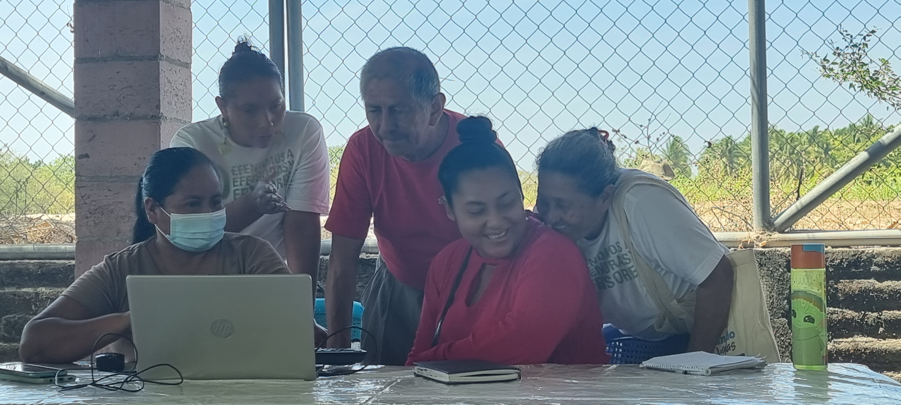
  <figcaption>Responsables de una Junta de Agua del Salvador realizando la facturación mensual. (C) 2024 iCarto.</figcaption>
</figure>

 
<figure>
  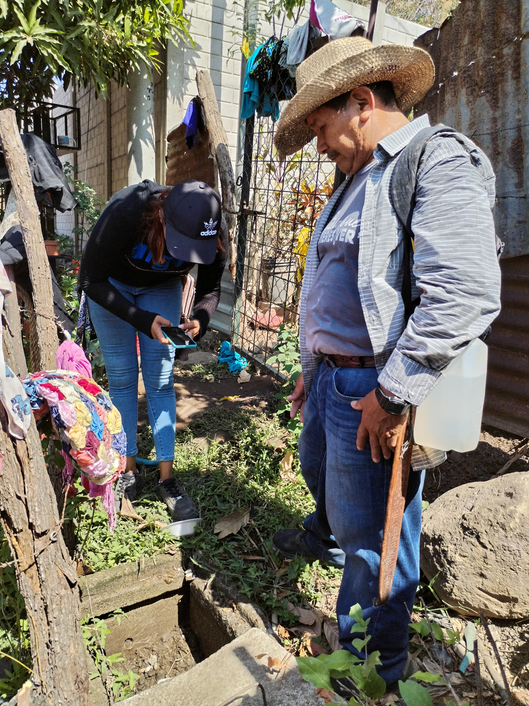
  <figcaption>Dos personas tomando una lectura de caudal en un contador con una aplicación móvil. (C) 2024 iCarto.</figcaption>
</figure>

???

Pocas veces las imágenes en las que pensamos son parecidas a estas otras.

Pero la realidad de millones de personas en el mundo, es la de la segunda imagen, no la de la primera.

---

  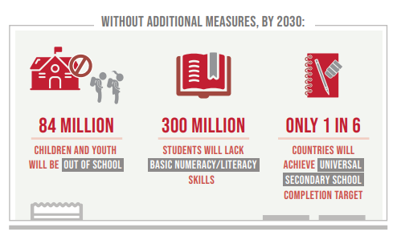

  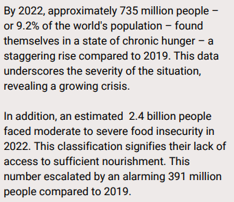

  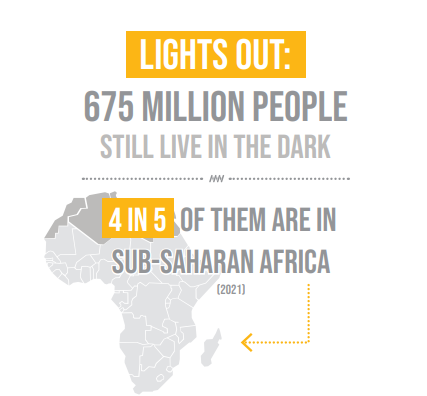
  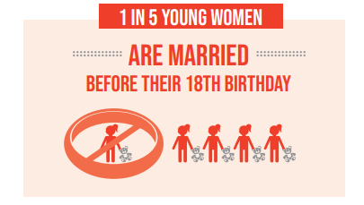

  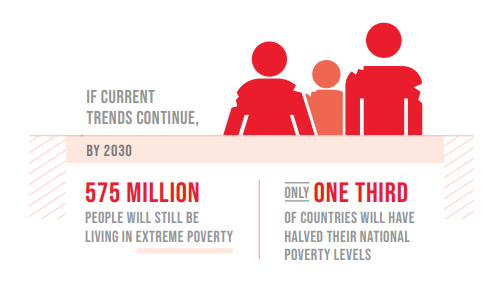

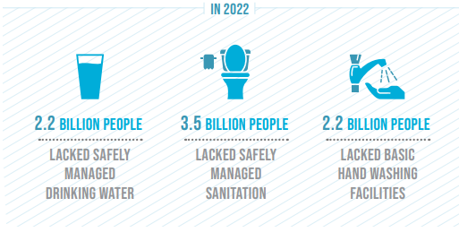

[Naciones Unidas 2015](http://www.un.org/sustainabledevelopment/)

---

Queremos una aplicación para pagar con el móvil las facturas de la Junta de Agua.

???

Nuestra historia comienza cuando alguien "decide" que el problema de Iris, es que necesita una aplicación para que las socias de las juntas paguen su factura a través del móvil, y contactan con nuestro equipo para implementarla.

Nos parece una idea interesante y aceptamos. Pero primero, hacemos una identificación del contexto
Con el proyecto concedido ayudamos a hacer una identificación de cuales eran los problemas, en lugar de empezar por proponer directamente soluciones.

Vimos que la mayoría de Juntas de Agua no tenían internet, muchas ni siquiera tenían ordenador. Las socias de las juntas no tenían tarjeta de crédito, y las opciones de pago "informal" con el móvil era complicadas administrativamente.

---

<figure>
  
  <figcaption>Libro de contabilidad de una Junta de Agua. (C) 2024 iCarto.</figcaption>
</figure>

 
<figure>
  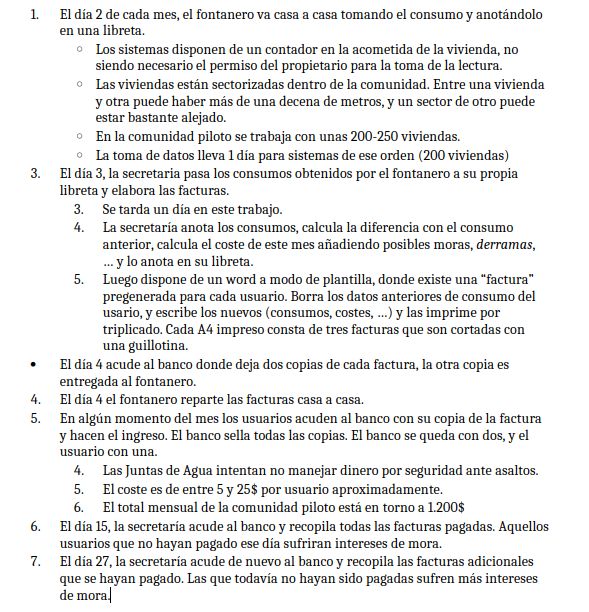
  <figcaption>Elaboración propia.</figcaption>
</figure>

???

Para que nos hagamos una idea, así es como se lleva la contabilidad de muchas Juntas.

Los problemas, no estaban tanto del lado de las socias, si no del lado de la institución.

Explicar el proceso. Explicar cómo se elaboraban las facturas.

---

## Mismas necesidades

### Distintas soluciones

<figure>
  
  <figcaption>Elaboración propia con IA</figcaption>
</figure>

???

Las necesidades (aunque más acuciantes) en todos lados son los mismas. Quiero tener agua. Quiero tener una vida plena. No quiero vivir rodeada de basura. Quiero que no me atraquen cuando voy al banco.

Pero las soluciones no.

Intentar aplicar soluciones sin valorar el contexto, pasa continuamente, tanto en el Norte como en el Sur Global.

El banco mundial gasta millones de € en poner estaciones telemétricas. Conozco un sitio en el que el software de configuración de las estaciones dejó de funcionar en el portátil donde estaba instalado, e iban a campo con una cpu, pantalla, teclado y un generador diesel.

Esto pasa sólo en el Sur. Hace unos años hicimos una auditoría / consultoría GIS para un municipio de España. En nuestras conclusiones sugeríamos usar un software libre y gratuito y mucha, mucha formación. Si se podía contratar a alguien que gestionara lo que querían hacer. Nos pidieron cambiarlo, el informe era para adjuntar a una licitación de Smart Cities con dinero de Europa. Había que hablar de sensores en contenedores y cosas así.

---

## La tecnología es crucial en las soluciones

<figure>
  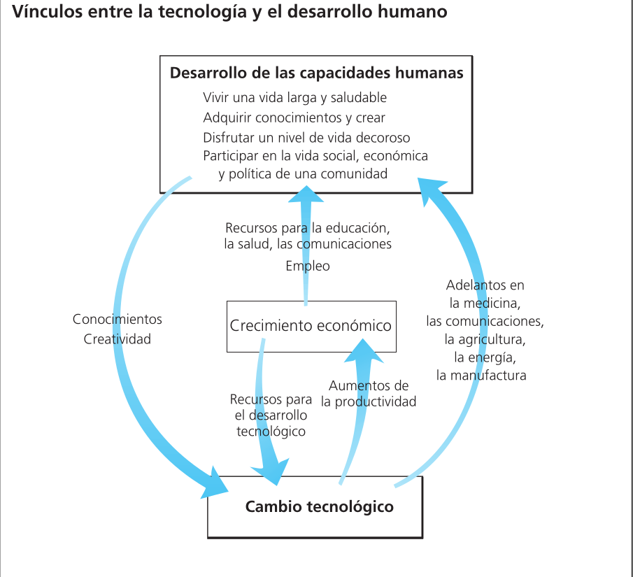
  <figcaption><a href="https://hdr.undp.org/content/human-development-report-2001">Human Development Report 2001</a>. Making New Technologies Work for Human Development</figcaption>
</figure>

---

## Pero no cualquier tecnología

<figure>
  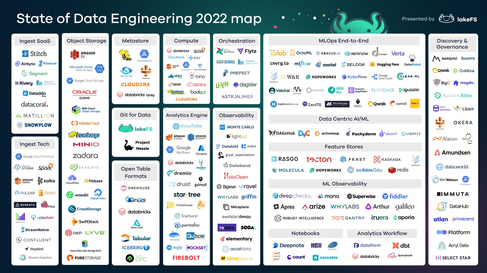
    <figcaption>https://lakefs.io/blog/the-state-of-data-engineering-2022/</figcaption>
</figure>

???

Antes de esta aplicación que desarrollamos existía otra de una empresa pero promocionada por la institución responsable de agua en El Salvador. Una aplicación que hacía muchísimas cosas pero pensada para prestadores de servicio grandes (más de 2000 personas) y privativa. No era una opción.

Más o menos en paralelo se desarrolló otra aplicación pensada para JA pequeñas. Mucho menos dinero que nuestro proyecto y hacía muchísimas más cosas (Kobo Toolbox para el móvil, Metabase para dashboards, desplegada en cloud, ...). En las jornadas de intercambio que se hicieron durante el proyecto, la gente estaba encantada. A los 6 meses no funcionaba. Pagar y mantener el servidor, seguimiento, ...

---

<figure>
  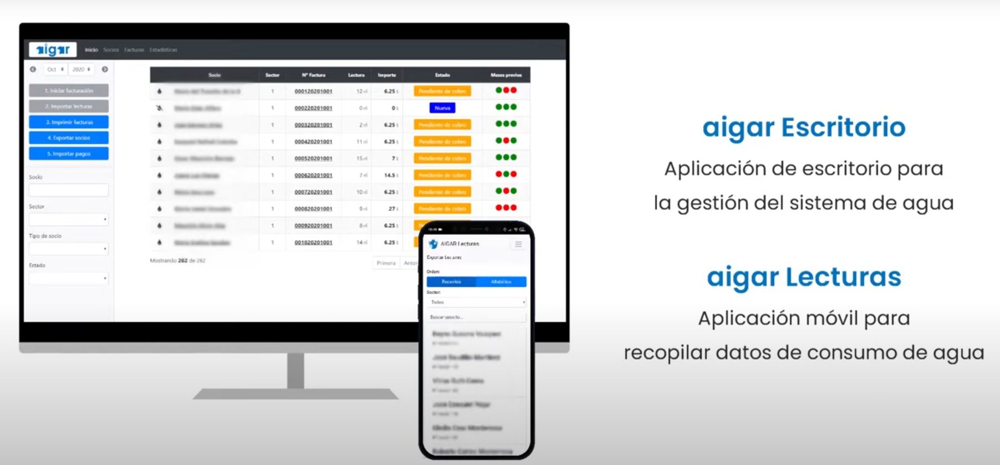
  <figcaption><a href="https://www.youtube.com/watch?v=F3GUaEo42tA">https://www.youtube.com/watch?v=F3GUaEo42tA</a></figcaption>
</figure>

???

La primera versión era una aplicación de escritorio hecha con tecnologías web (Web Desktopable App), con un par de tablas y formularios, y una app móvil de menos de 500 líneas.

---

  

  

  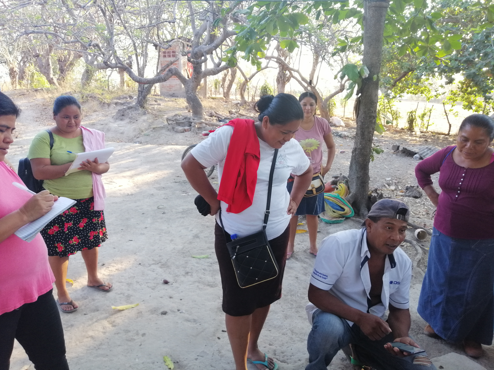
  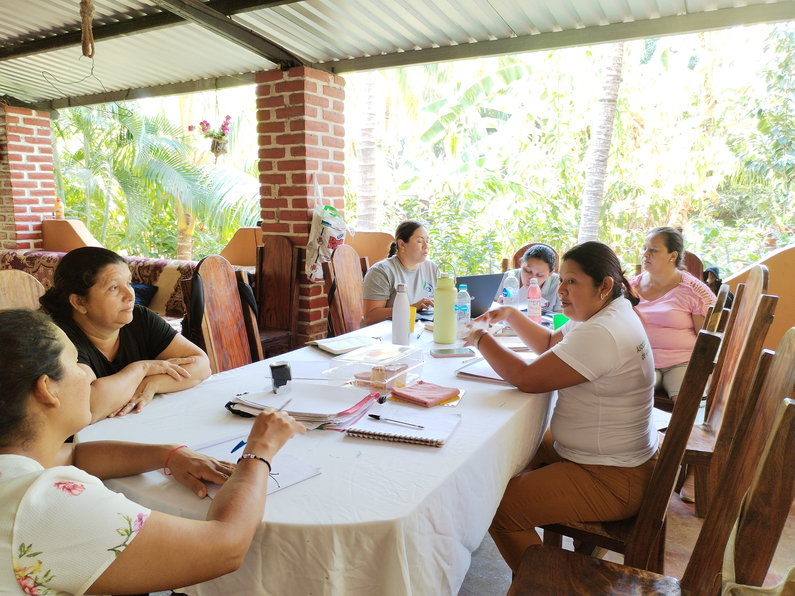

???

Pero no fue la aplicación lo que hizo que el proyecto funcionara.

Esto, tras la identificación empezó en 2018 - 2019, en una Junta de Agua concreta. Entendiendo los problemas, y arrancando con una "simple" hoja de cálculo.

Después vino la aplicación, super específica para esta JA, y durante 8 meses se iba a campo a acompañarlos en la toma de datos y la facturación.

COVID Mediante.

En 2022 se hizo una nueva fase, para generalizar la aplicación, y con una Junta de Agua "complicada" como _beta tester_. Y con personal de la ONG Local y la Asociación de Juntas de Agua involucradas en todas las partes de la implementación (formación de formadoras, ...)

En 2024 una tercera fase, la aplicación ya está en 7 comunidades, y el personal local, todavía no lidera las implementaciones, pero participa y hace el seguimiento.

---

## Tecnología para el Desarrollo Humano

???

Lo que quiero decir es que la tecnología no es un fin en si mismo, ni funciona por si sóla.

Las usuarias tienen que apropiarse de ella. Empoderarse. Y el proceso tiene que ser lo más integral que se puede.

Se trata de cambiar procesos y metodologías, implementar buenas prácticas, ...

En esta última fase por ejemplo se colabora con la universidad en elaborar una "maestría", en gestión de sistemas de agua de este tipo.

---

## Conclusiones

???

Cerrando por que prefiero que haya espacio para debate que se que son horas malas.

---

## Conclusiones

-   **No hay soluciones mágicas**

???

Los financiadores y las usuarias quien que todo funcionen, marcar el _check_ de hecho. Pero no hay soluciones mágicas.

La gente cree que "La Aplicación" va a hacer que trabajen menos. Y no es así. Las aplicaciones no disminuyen el trabajo, te habilitan a dedicar tiempo a tareas que antes no podías hacer porqué no tenías los datos, por qué eran muy tediosas, ...

---

## Conclusiones

-   No hay soluciones mágicas
-   **La tecnología funciona, cuando se adapta al contexto, y no por si sóla**

???

Formación, seguimiento, acompañamiento.

---

## Conclusiones

-   No hay soluciones mágicas
-   La tecnología funciona, cuando se adapta al contexto
-   **El cambio lleva tiempo**

???

Los cambios llevan tiempo. Mucho acompañamiento. Mucha formación. Es difícil acertar a la primera con lo que de verdad hace falta.

---

<figure>
  
  <figcaption><a href="https://www.pinterest.com/pin/855895104157311615">https://www.pinterest.com/pin/855895104157311615</a></figcaption>
</figure>

???

### Quien tiene la responsabilidad

Quien toma decisiones tiene responsabilidad. Usuarias y ciudadanas tiene responsabilidad.

Pero también nosotras, programadoras, creadoras, consultoras, expertas, tenemos una parte de culpa.

Cuantos dashboards programamos que sabemos que nadie va a mirar, o que dicen lo que nos han dicho que tienen que decir. Simplemente reafirman los sesgos del receptor.

Y no se trata de fustigarse, si no que cada cual en su pequeño espacio, en su ámbito local, sepa que lo que hace tiene una influencia global.
