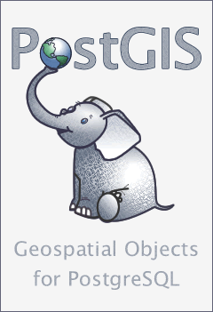
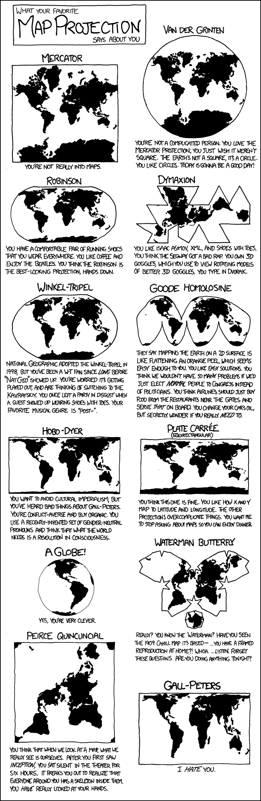
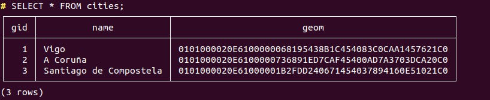
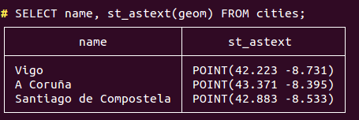
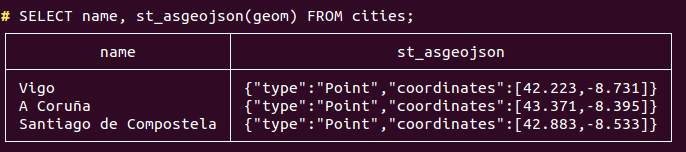
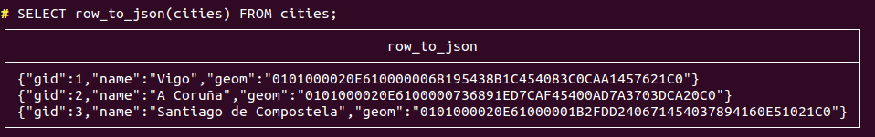

class: center, middle <!-- for title in the center of the slide -->
name: primera-diapo

Francisco Puga

fran.puga (at) gmail.com

https://twitter.com/fpuga

http://conocimientoabierto.es

http://icarto.es

???

python -m SimpleHTTPServer 8000

Para los que no lo sepan hoy es PostGIS Day, y por tanto la charla sólo podía ir sobre...

---

.center[]

???

http://giphy.com/gifs/elephant-wastedgifs-12oFDpQAh4ZvSU

... elefantes. O más concretamente porque yo de elefantes no se demasiado sobre...
---

.center[]

???

... el elefante que representa a PostGIS como logo. Por empezar por lo básico, PostGIS es la respuesta a la pregunta
---

# ¿Cómo almaceno y manipulo información geográfica en una base de datos?

---


# Aunque hace muchas más cosas

* [Cálculo de rutas](http://pgrouting.org/)
* [Geocodificación y Geodificación inversa](http://postgis.net/docs/manual-dev/Extras.html) (Sólo EEUU)
* [Conectar con excel](http://www.postgresonline.com/journal/archives/339-OGR-foreign-data-wrapper-on-Windows-first-taste.html) (PostGIS + OGR FDW)
* [Manipulación de imágenes](http://www.bostongis.com/blog/index.php?/archives/205-Waiting-for-PostGIS-2.1-ST_Resize-not-just-for-GIS.html) (resize, ...)
* Topología, Segmentación Dinámica y Referenciación Lineal, 3D, [LIDAR](https://github.com/pgpointcloud/pointcloud), ...

???

Aunque hace muchas más cosas. Tanto relacionadas con los datos espaciales, como más curiosas como poder manipular imágenes en la base de datos (reescalado,...)

---

# ¿Qué es PostGIS?

* Una extensión para PostgreSQL
* Gratuita, Software Libre y *State of the Art*
* Conforme a standards
* Fácil de usar

# ¿Qué aporta PostGIS a PostgreSQL?

* Nuevos tipos de datos. Fundamentalmente: *GEOMETRY*
* Nuevas funciones: *ST_xxx*

---

# Instalación

```bash
sudo apt-get update
sudo apt-get install -y postgresql postgresql-contrib
sudo apt-get install -y postgis postgresql-9.5-postgis-2.2

sudo -u postgres createdb postgis_example
sudo -u postgres psql -d postgis_example -c "CREATE EXTENSION postgis;"
```

En windows (o linux, o mac) podemos usar un [instalador](http://www.enterprisedb.com/products-services-training/pgdownload#windows)

---

#### Crear una tabla de puntos

```sql
CREATE TABLE cities (
  gid SERIAL PRIMARY KEY,
  name text,
  geom GEOMETRY(Point, 4326)
);
CREATE INDEX ON cities USING GIST ("geom");
```

#### Crear una tabla de líneas

```sql
CREATE TABLE streets (
  gid SERIAL PRIMARY KEY,
  name text,
  geom GEOMETRY(MultiLineString, 4326)
);
CREATE INDEX ON streets USING GIST ("geom");
```

#### Crear una tabla de polígonos

```sql
CREATE TABLE cities (
  gid SERIAL PRIMARY KEY,
  name text,
  geom GEOMETRY(MultiPolygon, 4326)
);
CREATE INDEX ON cities USING GIST ("geom");
```

???

Representar información geográfica. Ciudad como punto o como polígono. Carretera como punto o como polígono. Ciudades en un mapa del mundo: puntos, Si quiero representar los colegios dentro de una ciudad: polígono

---

#### Dont' do this (only for special cases)

```sql
SELECT AddGeometryColumn ('my_schema','my_spatial_table','geom',4326,'POINT',2);
```

#### Coordenadas Z y/o M

* Point: POINT(0 0) -- XY
* PointZ: POINT(0 0 10) --XYZ
* PointM: POINT(0 0 10) - XYM
* PointZM POINT(0 0 10 10) -XYZM

#### Single vs Multi vs Geometry Collection

* Geometry Collection: GEOMETRY que almacena geometrías de distinto tipo a la vez
* Single. Cada fila de la base de datos es una sóla geometría (POINT, LINESTRING, POLYGON)
* Multi. Cada fila de la base de datos puede almacenar más de una geometría del mismo tipo (MULTIPOINT, MULTILINESTRING, MULTIPOLYGON)

???

https://alastaira.wordpress.com/2011/01/21/splitting-multi-geometries-into-single-geometries/

Consejo: No usar geometry collection y usar siempre Multi

---

# Proyecciones

* EPSG:4326 (GPS, GeoJSON, habitual si no necesitas precisión)
* EPSG:3857 (~4326, Google Maps, OpenStreetMap)
* EPSG:25829, EPSG:25830 (Oficial de España)

???

Si no estáis en el mundo GIS, lo que tenéis que saber sobre proyecciones son tres cosas:

* Usad siempre 4326
* Si trabájais con cartografía española oficial 25830 para la península, 25829 para galicia, y la de canarías es otra
* Cada cual tiene la suya

---

.center[[](https://xkcd.com/977/)]

---

# Cargar datos espaciales (1)

### De shape

```bash
shp2pgsql -s 4326 -W UTF-8 cities.shp cities > cities.sql
psql -d postgis_example -f cities.sql
```

### De otras fuentes

* ogr2ogr
* gis de escritorio
* scripting

---

# Cargar datos espaciales (2)

```sql
INSERT INTO cities (name, geom) VALUES 
(
  'Vigo',
  ST_GeomFromGeoJSON(
    '{"type":"Point","coordinates":[42.223, -8.731]}'
  )
),
(
  'A Coruña',
  ST_GeomFromText(
    'POINT(43.371 -8.395)',
    4326
  )
),
(
  'Santiago de Compostela',
  ST_SetSRID(
    ST_MakePoint(42.883, -8.533),
    4326
  )
);
```
---

# Consultas y operaciones (1)



---

# Consultas y operaciones (2)

.center[]

.center[]

---

# Consultas y operaciones (3)

.center[]

---

# Consultas y operaciones (4)

```sql
SELECT row_to_json(fc)
FROM ( 
   SELECT 'FeatureCollection' As type,
          array_to_json(array_agg(f)) As features
   FROM (
     SELECT 'Feature' As type,
            ST_AsGeoJSON(lg.geom)::json As geometry,
            row_to_json(
              ( SELECT l FROM (SELECT gid, name) As l )
            ) As properties
     FROM cities As lg
   ) As f
)  As fc;
```
???

http://www.postgresonline.com/journal/archives/267-Creating-GeoJSON-Feature-Collections-with-JSON-and-PostGIS-functions.html

---

class: smallsize

```json
{
  "type": "FeatureCollection",
  "features": [
    {
      "type": "Feature",
      "geometry": {
        "type": "Point",
        "coordinates": [ 42.223, -8.731 ]
      },
      "properties": {
        "gid": 1,
        "name": "Vigo"
      }
    },
    {
      "type": "Feature",
      "geometry": {
        "type": "Point",
        "coordinates": [ 43.371, -8.395 ]
      },
      "properties": {
        "gid": 2,
        "name": "A Coru\u00f1a"
      }
    },
    {
      "type": "Feature",
      "geometry": {
        "type": "Point",
        "coordinates": [ 42.883, -8.533 ]
      },
      "properties": {
        "gid": 3,
        "name": "Santiago de Compostela"
      }
    }
  ]
}
```
---

# Python y PostGIS

* [GeoDjango](https://docs.djangoproject.com/en/1.10/ref/contrib/gis/)
* [GeoAlchemy](http://geoalchemy.org/)
* [pyscopg-postgis](https://github.com/yohanboniface/psycopg-postgis)
* [bindings gdal/ogr](https://pypi.python.org/pypi/GDAL/)
* [shapely](https://github.com/Toblerity/Shapely) y [fiona](https://github.com/Toblerity/Fiona)

---

### geoalchemy - Instalación

```bash
pip install psycopg2 SQLAlchemy geoalchemy2
```

---

### geoalchemy - Modelos (1)

```python
from sqlalchemy.ext.declarative import declarative_base
from sqlalchemy import Column, Integer, String
from geoalchemy2 import Geometry

Base = declarative_base()

class Cities(Base):
    __tablename__ = 'cities'
    gid = Column(Integer, primary_key=True)
    name = Column(String)
    geom = Column(Geometry('POINT', '4326'), index=True)
    
    def __json__(self, request):
        from geoalchemy2.shape import to_shape
        from shapely.geometry import mapping

        return {
            'gid': self.gid,
            'name': self.name,
            'geom': mapping(to_shape(self.geom))
        }
```

---

### geoalchemy - Modelos (2)
```python
    def as_geojson_feature(self, request):
        from geoalchemy2.shape import to_shape
        from shapely.geometry import mapping

        return {
            'type': 'Feature',
            'properties': {
                'gid': self.gid,
                'name': self.name,
            },
            'geometry': mapping(to_shape(self.geom))
        }
```

---

### geoalchemy - Modelos (3)

```python
    def update_from_json(self, json):
        from geoalchemy2.shape import from_shape
        from shapely.geometry import shape
        
        self.gid = json.get('gid')
        self.name = json.get('name')
        self.geom = from_shape(shape(json.get('geometry')))
```
---

# PostGIS 

### lighting talk (python-vigo, 17/11/2016)

Francisco Puga

fran.puga (at) gmail.com

https://twitter.com/fpuga

http://conocimientoabierto.es

http://icarto.es
